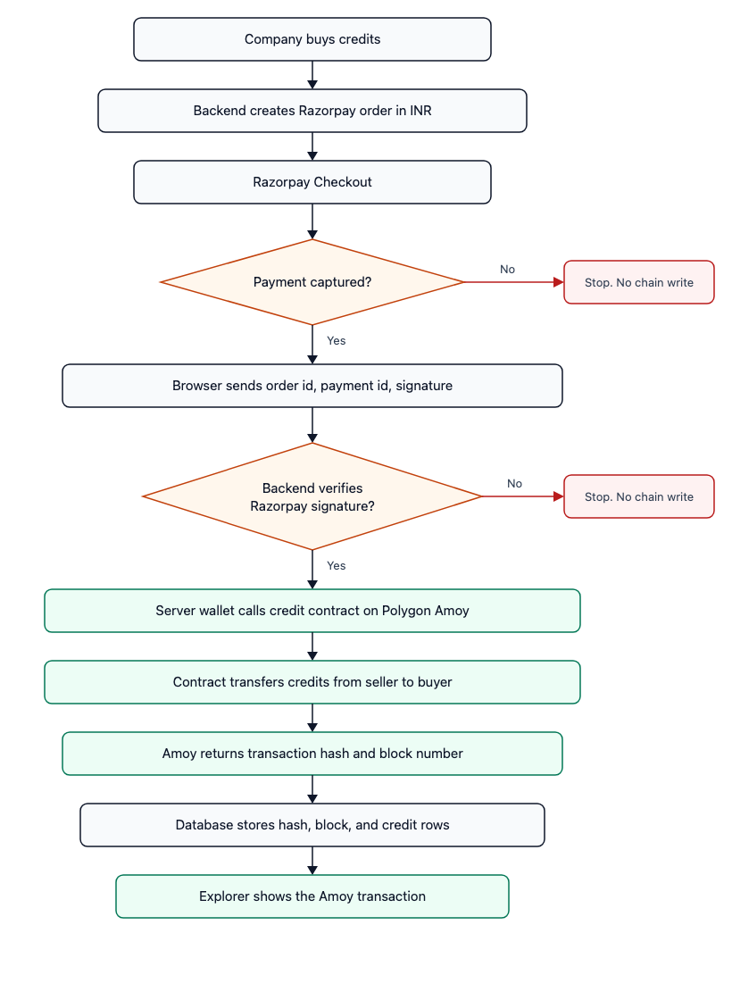
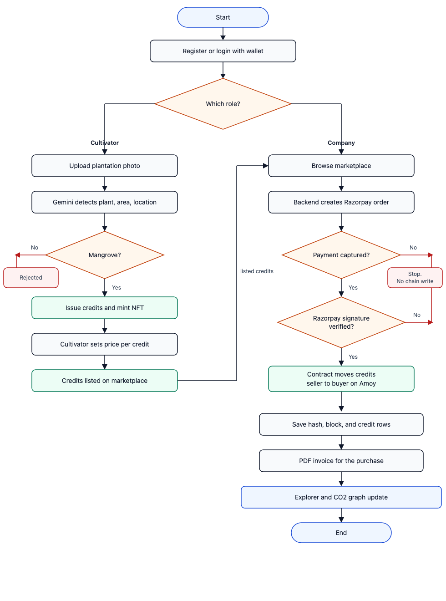
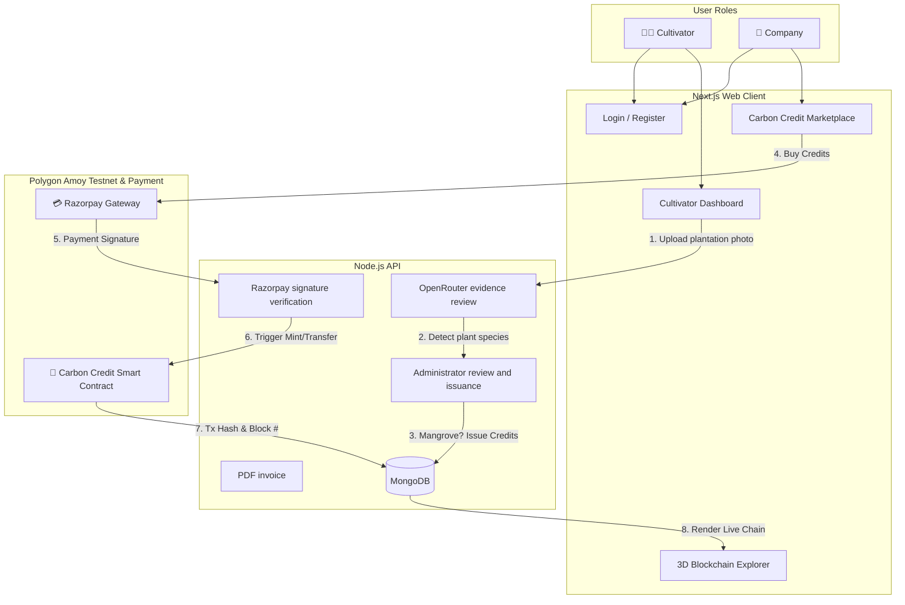
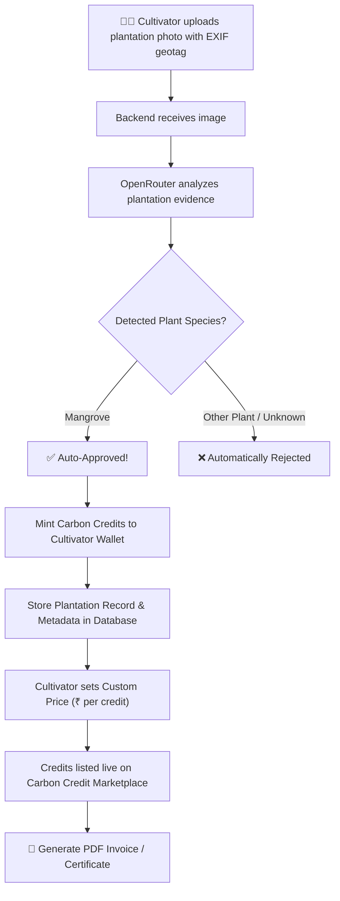
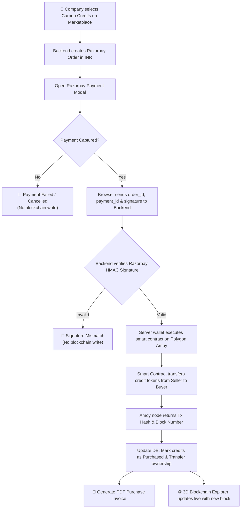

# CarbonChain

An AI-powered Web3 carbon-credit marketplace that connects blue-carbon restoration projects with enterprises through verification, credit issuance, and ownership tracking.

**September 2025 – Present · QuantumNodes**

**Stack:** Next.js, TypeScript, Node.js, MongoDB, Web3, Polygon Amoy, Razorpay, OpenRouter

For the project presentation: https://drive.google.com/file/d/1cyYaBUVu5SmyUaRhu8grlUCqxifaADPp/view?usp=sharing

## 🌟 Overview

CarbonChain lets restoration projects submit plantation evidence and lets companies buy the resulting carbon credits. OpenRouter reviews the evidence and returns structured findings for administrator review and risk identification. Approved credits are issued on Polygon Amoy, priced by the project, and purchased by companies through Razorpay. Each purchase is tied to an on-chain ownership transfer that the explorer can audit.

## ✨ Features

### Core Features
- **OpenRouter verification**: Analyzes plantation evidence and returns structured insights for administrator review and risk identification
- **Credit issuance**: Mangrove restoration that passes review is issued as carbon credits on Polygon Amoy
- **Carbon Credit Marketplace**: Buy and sell carbon credits with dynamic pricing set by cultivators
- **3D Blockchain Explorer**: Interactive 3D chain visualization with clickable blocks
- **CO2 Decline Profile**: Real-time tracking of cumulative CO2 removal from the atmosphere
- **PDF Invoice Generation**: Automated invoice generation for approved plantations and purchases
- **Real-time Transaction Tracking**: Monitor all credit transfers and minting operations
- **Geotagging Support**: Extract location data from uploaded images (EXIF data)
- **Public Access**: View blockchain explorer and CO2 graphs without login

### User Roles

#### 👨‍🌾 Cultivator
- Upload plantation photos with geotagging
- Get AI-powered plant type detection
- Automatic approval for Mangrove trees
- Earn carbon credits upon approval
- Set custom prices for approved credits
- View wallet balance and transaction history
- Download PDF invoices
- Access marketplace to set credit prices

#### 🏢 Company
- Browse available carbon credits in the marketplace
- Purchase credits through Razorpay, with ownership transferred on Polygon Amoy after payment confirmation
- View purchased credits and transaction history
- Track carbon offset progress
- View CO2 decline profile

## 🏗️ Project Structure

```
ECHOCHAIN2/
├── nccr-backend/          # Node.js API
│   ├── app.py             # API entry
│   ├── models.py          # MongoDB document models
│   ├── config.py          # Configuration settings
│   ├── ai.py              # OpenRouter verification
│   ├── invoice.py         # PDF invoice generation
│   ├── utils.py           # Polygon issuance and transfer helpers
│   ├── requirements.txt   # Service dependencies
│   └── README.md          # Backend documentation
│
├── frontend/              # Next.js + TypeScript web application
│   ├── src/
│   │   ├── pages/         # Page components
│   │   │   ├── Login.jsx      # Login/Registration page
│   │   │   ├── Cultivator.jsx # Cultivator dashboard
│   │   │   ├── Marketplace.jsx # Company marketplace
│   │   │   └── Explorer.jsx     # Blockchain explorer
│   │   ├── components/     # Reusable components
│   │   ├── utils/         # API client & utilities
│   │   └── styles/         # Global styles
│   ├── package.json
│   └── README.md          # Frontend documentation
```

## 🚀 Quick Start

### Prerequisites

- **Backend**: Node.js 18+
- **Frontend**: Node.js 18+ and npm
- **Database**: MongoDB
- **Keys**: OpenRouter API key, Razorpay key id and secret, Polygon Amoy RPC URL and server wallet

### Installation & Setup

#### 1. Backend Setup

```bash
# Navigate to backend directory
cd nccr-backend

# Create virtual environment
python -m venv venv

# Activate virtual environment
# On macOS/Linux:
source venv/bin/activate
# On Windows:
venv\Scripts\activate

# Install dependencies
pip install -r requirements.txt

# Set up environment variables
cp env.example .env
# Edit .env and add your configuration:
# - SECRET_KEY
# - MONGODB_URI
# - OPENROUTER_API_KEY
# - RAZORPAY_KEY_ID and RAZORPAY_KEY_SECRET
# - POLYGON_AMOY_RPC_URL and SERVER_WALLET_PRIVATE_KEY
```

#### 2. Frontend Setup

```bash
# Navigate to frontend directory
cd frontend

# Install dependencies
npm install
```

## 🎯 Running the Application

### Development Mode

#### Start Backend Server

```bash
cd nccr-backend
source venv/bin/activate  # On Windows: venv\Scripts\activate
python run.py
```

The backend API will be available at `http://localhost:8000`

#### Start Frontend Server

```bash
cd frontend
npm run dev
```

The frontend will be available at `http://localhost:3000`

The frontend is configured to proxy API requests from `/api` to `http://localhost:8000`.

### Production Mode

#### Backend

The API serves on port 8000. In production, run it behind a reverse proxy with MongoDB, Razorpay, OpenRouter, and the Polygon Amoy wallet configured.

#### Frontend

Build the frontend for production:

```bash
cd frontend
npm run build
```

The built files will be in the `dist/` directory.

## 🔧 Configuration

### Environment Variables

Create a `.env` file in the `nccr-backend/` directory:

```env
SECRET_KEY=your-secret-key-here
MONGODB_URI=mongodb://localhost:27017/carbonchain
OPENROUTER_API_KEY=your-openrouter-api-key
RAZORPAY_KEY_ID=your-razorpay-key-id
RAZORPAY_KEY_SECRET=your-razorpay-key-secret
POLYGON_AMOY_RPC_URL=https://rpc-amoy.polygon.technology
SERVER_WALLET_PRIVATE_KEY=your-server-wallet-key
```

### Database

Application data is stored in MongoDB: users, plantation evidence, credit balances, and the transaction hash returned by Polygon Amoy.

### OpenRouter verification

Plantation photos are sent to OpenRouter. The model returns plant type, location context, and risk notes for administrator review. Mangrove restoration that clears review is issued as credits on Polygon Amoy.

## 📚 API Documentation

### Base URL
```
http://localhost:8000
```

### Key Endpoints

#### Authentication
- `POST /login` - User login (requires username and wallet_address)
- `POST /register` - User registration (cultivator or company)

#### Plantation Requests
- `POST /analyze-plantation` - AI analysis of plantation image
- `POST /upload-request` - Upload plantation request (auto-approves Mangrove, rejects others)

#### Marketplace
- `GET /marketplace` - List available credits with pricing
- `POST /credit/<id>/set-price` - Set price for cultivator's approved credits
- `POST /create-payment-order` - Create Razorpay order
- `POST /verify-payment` - Verify payment and transfer credits
- `POST /buy-credits` - Buy credits (alternative method)

#### User Management
- `GET /user/<id>/credits` - Get user credits and wallet balance

#### Blockchain Explorer
- `GET /explorer` - Get all transactions (publicly accessible)

#### CO2 Tracking
- `GET /co2-decline-profile` - Get CO2 removal data over time (publicly accessible)

#### Invoicing
- `GET /invoice/<request_id>` - Download PDF invoice for plantation
- `GET /invoice/purchase/<transaction_id>` - Download PDF invoice for purchase

For detailed API documentation, see [nccr-backend/README.md](nccr-backend/README.md)

## 🎨 Tech Stack

### Application
- **Next.js** and **TypeScript** — web application
- **Node.js** — API for verification, payments, and chain writes
- **MongoDB** — users, plantation evidence, credits, and transaction records
- **OpenRouter** — plantation evidence analysis and risk notes
- **Web3** on **Polygon Amoy** — credit issuance and ownership transfer
- **Razorpay** — corporate credit purchases in INR
- **TailwindCSS**, **Recharts**, and **GSAP** — interface, CO2 charts, and motion

## 🗄️ Database Schema

The application uses the following main models:

- **User**: Stores user information (name, role, wallet_address)
- **PlantationRequest**: Tracks cultivation requests (status, plant_type, co2_removed)
- **CarbonCredit**: Manages carbon credits (credits, price_per_credit, nft_metadata, tx_hash)
- **Transaction**: On-chain issuance and ownership transfers (from_user, to_user, credits, tx_hash, block_number)

## 🔐 Security Features

- Input validation and sanitization
- File upload security (image files only)
- Request validation on the Node.js API
- CORS configuration for the Next.js application
- Razorpay signature check before any Polygon write
- Environment variable management for OpenRouter, Razorpay, and the Amoy wallet

## 🎯 Key Features Explained

### Verification and issuance
- A cultivator uploads plantation evidence, including geotag data from the photo
- OpenRouter returns plant type, estimated removal, and risk notes for administrator review
- Mangrove restoration that clears review is issued as carbon credits on Polygon Amoy
- Other evidence stays unissued until the review supports credit issuance

### Dynamic Pricing
- Cultivators can set custom prices for their approved carbon credits
- Prices can only be set after approval (Mangrove detection)
- Prices are used in marketplace calculations
- Buyers pay based on the seller's set price per credit

### Razorpay payment recorded on Polygon Amoy

Razorpay settles the rupees. A carbon-credit smart contract on Polygon Amoy settles the credits. The contract runs only after the backend verifies the Razorpay signature. Gas on Amoy is paid by the server wallet, not by the company.



### 3D Blockchain Explorer
- Interactive 3D cube visualization of blockchain blocks
- Horizontal scrollable chain layout
- Click blocks to view detailed transaction information
- Smooth animations and hover effects

### CO2 Decline Profile
- Real-time graph showing cumulative CO2 removal over time
- Available on both cultivator and company dashboards
- Publicly accessible from login page
- Area chart with gradient visualization

## 🔄 System Workflows & Flowcharts

### Complete project flow

A cultivator registers, uploads plantation evidence, and receives credits when OpenRouter review supports mangrove restoration. Those credits are priced and listed. A company buys them with Razorpay. After the payment signature checks out, the credit contract on Polygon Amoy moves ownership, MongoDB stores the transaction hash, and the explorer updates.



### 1. Overall System Architecture


### 2. Cultivator Verification & Credit Issuance Flow


### 3. Company Purchase & Blockchain Settlement Flow


## 🧪 Accounts

The application creates these accounts on first run:

- **Cultivator**: 
  - Name: `Demo Cultivator`
  - Wallet: `0x1234567890abcdef1234567890abcdef12345678`
  
- **Company**: 
  - Name: `Demo Company`
  - Wallet: `0xabcdef1234567890abcdef1234567890abcdef12`

Use these for testing the application.

## 🐛 Troubleshooting

### Backend Issues

1. **Database Connection Error**
   - Check `DATABASE_URL` in `.env`
   - Ensure database file has write permissions

2. **Verification has no plant result**
   - Confirm `OPENROUTER_API_KEY` in `.env`
   - Confirm the key is accepted by OpenRouter

3. **Port Already in Use**
   - Change port in `run.py` (default: 8000)
   - Or stop the process using the port

4. **Module Not Found Errors**
   - Ensure all dependencies are installed: `pip install -r requirements.txt`
   - Common missing packages: `setuptools`, `reportlab`

### Frontend Issues

1. **API Connection Failed**
   - Ensure backend is running on port 8000
   - Check proxy configuration in `vite.config.js`

2. **Build Errors**
   - Clear `node_modules` and reinstall: `rm -rf node_modules && npm install`
   - Check Node.js version (requires 16+)

3. **Chart Not Displaying**
   - Ensure `recharts` is installed: `npm install recharts`

## 🚢 Deployment

### Backend Deployment

1. Run the Node.js API behind a reverse proxy
2. Configure OpenRouter, Razorpay, MongoDB, and the Polygon Amoy wallet
3. Point `MONGODB_URI` at the production database

### Frontend Deployment

1. Build the application: `npm run build`
2. Serve the `dist/` directory with a web server (Nginx, Apache)
3. Configure API proxy to point to backend URL

## 📄 License

This project is licensed under the MIT License.

## 🤝 Contributing

1. Fork the repository
2. Create a feature branch
3. Make your changes
4. Add tests if applicable
5. Submit a pull request

## 📞 Support

For issues and questions, please open an issue on the repository.

## 🔗 Related Documentation

- [Backend API Documentation](nccr-backend/README.md)
- [Frontend Documentation](frontend/README.md)

---

**CarbonChain by QuantumNodes**
